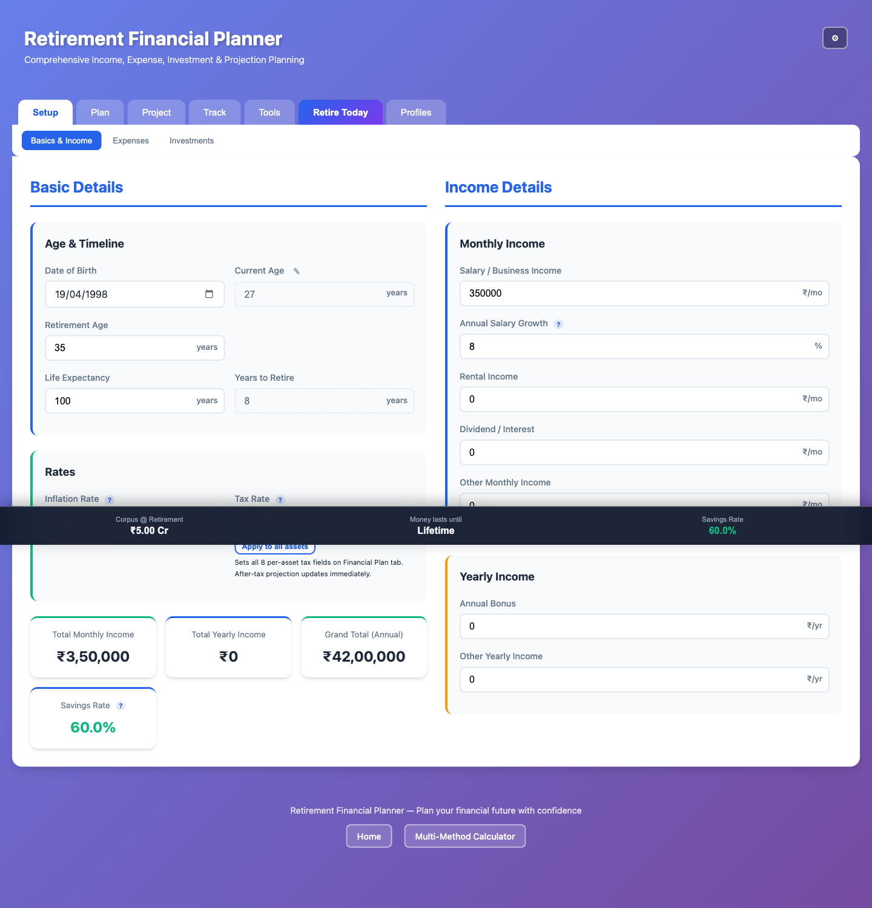
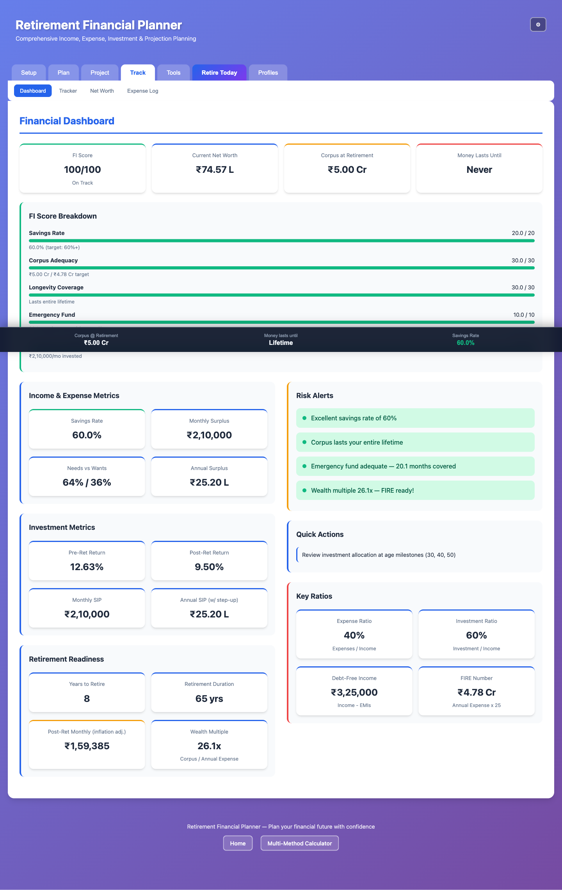
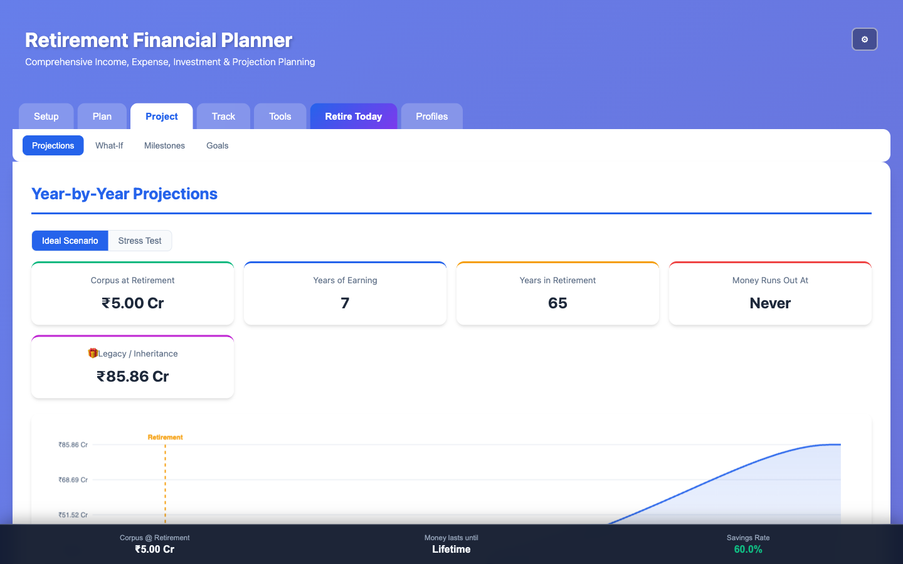
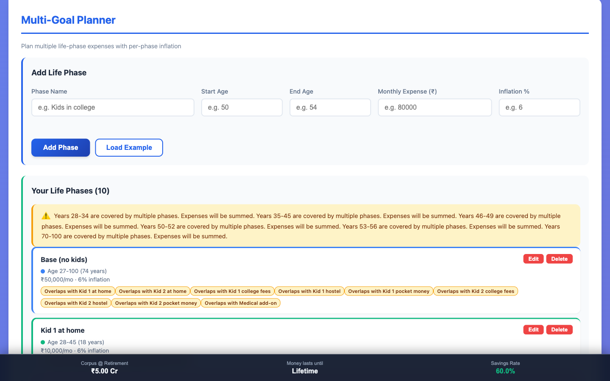
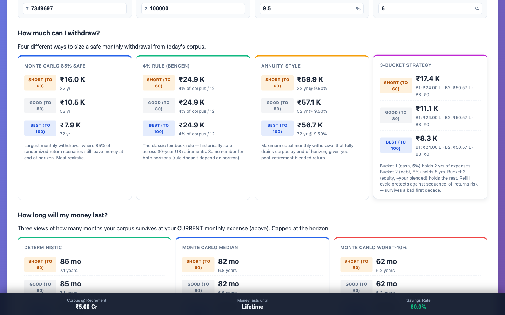
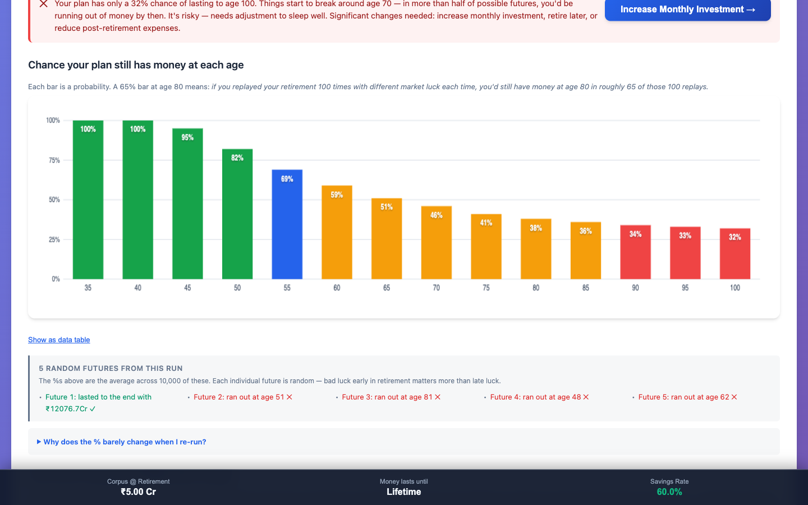

# Finance Calculator Suite

A collection of retirement and FIRE (Financial Independence, Retire Early) planning tools, built as a vanilla HTML / CSS / JavaScript app — no framework, no bundler, no npm install. Runs from a static HTTP server. Designed around Indian Rupee (₹) formatting and Indian salary/tax/inflation defaults, but the math is currency-agnostic.

The landing page (`index.html`) links to two apps:

1. **Retirement Planner** — the main app. 21 tabs covering Setup → Plan → Project → Track → Retire Today.
2. **Multi-Method FIRE Calculator** — side-by-side comparison of 5 published FIRE methods.

---

## Quick Start

```bash
make dev          # build + serve + open in browser (port 8765)
make stop         # stop the local server
make restart      # stop + dev
make status       # is it running? is index.html built?
```

`make dev` is idempotent — it always rebuilds the concatenated `retirement-planner/index.html` and starts a fresh `python3 -m http.server` on `PORT` (default `8765`). Override with `make dev PORT=9000`.

If you don't have `make`: `cd retirement-planner && bash build.sh && python3 -m http.server 8765`, then open `http://localhost:8765/index.html`.

> **Why a server, not just `file://`?** The Monte Carlo simulation runs in a Web Worker via Blob URL (works from both origins), but persistence, share-link URL params, and IndexedDB scoping behave more predictably over `http://localhost`.

---

## Screenshots

A quick tour of what you get after `make dev`. All shots at 1440×900.

### 1. Basics — set your inputs once, everything else flows from here


Age, income, expenses, return assumptions, rates. The sticky summary bar at the bottom updates live as you type — every other tab pulls from these numbers.

### 2. Dashboard — the FI scorecard


FI Score (0–100) with breakdown across Savings Rate, Corpus Adequacy, Longevity Coverage, and Emergency Fund. Headline cards on top, risk alerts on the right, key ratios below.

### 3. Projections — year-by-year, age 27 to 100


Anchored projection engine: each future row computes forward from today, so step-up SIPs apply at the right year. Headline cards (Corpus at Retirement, Years Earning, Years in Retirement, Money Runs Out At, Legacy) summarise the full table.

### 4. Multi-Goal Planner — model life phases with overlap detection


Add named life phases (Base, Kid 1 college, Medical add-on, etc.) with their own age range, monthly cost, and inflation. The planner detects overlapping phases and sums them so you don't undercount peak years.

### 5. Retire Today — what happens if I quit now?


Four withdrawal strategies (Monte Carlo Safe, 4% Rule, Annuity-Style, 3-Bucket) × three horizons (Short to 60 / Good to 80 / Best to 100) × two corpus sources (Live or Multi-Goal). Plus the survival "how long does my money last" cards. The Delay sub-tab projects the same matrix for retiring +1 to +10 years from now.

### 6. Monte Carlo — stress-test against 35 years of real market history


Probability of your plan still having money at each age, color-graded green→red. The "5 random futures from this run" panel shows individual sample paths (lasted to end / ran out at 51 / ran out at 81 / etc.) so you can see *why* the percentile dropped — early-retirement bad-luck years matter more than late-retirement ones. Runs in a Web Worker so the UI stays responsive.

---

## Retirement Planner

The flagship app. Data flows live across all tabs — edit your salary in **Basics** and the projections, dashboard, sticky summary bar, and Retire Today numbers all update in real time.

### Navigation (6 intent groups, 21 tabs)

| Group | Tabs |
| --- | --- |
| **Setup** | Basics, Expenses, Investments |
| **Plan** | Financial Plan, Goals, Multi-Goal, Emergency Fund, SIP |
| **Project** | Projections, Dashboard, Monte Carlo (What-If) |
| **Track** | Tracker (monthly actuals), Milestones, Loan, Expense Tracker, Net Worth |
| **Retire Today** | Live, Multi-Goal, Delay (Live), Delay (Multi-Goal) |
| **Tools / Profiles** | Profiles (save / load / share named scenarios) |

### Highlights

- **Anchored projection engine** with monthly SIP compounding and step-up support — each future row is computed forward from "today" rather than re-derived from current age, so step-ups apply at the correct year.
- **Retire Today** — answers "if I retired *now*, how long would my money last?" with three withdrawal strategies (Fixed, Inflation-Adjusted, Bengen) plus a 3-Bucket Strategy card, across triple horizons (Short to 60 / Good to 80 / Best to 100). Two source modes: Live corpus or Multi-Goal phase corpus. Dual sub-tabs for "what if I delayed retirement by N years?".
- **Multi-Goal planner** — model life phases (e.g., kid's education at 35, house at 40, retire at 50) with per-phase coverage tables driven by today's actual corpus.
- **Monte Carlo simulation** — historical-returns-driven, runs in a Web Worker so the UI doesn't freeze. Charted probability bands.
- **Tracker** — backfillable monthly actuals grid. Pick the earliest month you started using the app and edit history.
- **Persistence** — local autosave + optional cloud sync drawer. Every input persists.
- **Share Links** — copy a URL that encodes your full plan (optionally including Multi-Goal phases — adds ~3 KB).
- **Profiles** — save/load named scenarios (e.g., "Conservative", "Aggressive", "Single income").
- **Dark mode**, responsive layout (desktop / tablet / mobile), sticky summary bar always showing Corpus @ Retirement, Money lasts until, and Savings Rate.

### Tab → file map

Each tab is its own HTML fragment in `retirement-planner/pages/tab-*.html`, with a matching `js/calc-*.js` for logic. `build.sh` stitches them into a single `index.html` at build time. To edit a tab:

1. Edit `pages/tab-<name>.html` (markup) and/or `js/calc-<name>.js` (logic).
2. Run `make restart` (or just `make build && make open` if the server is still up).
3. Hard-reload the browser (the build appends `?v=<timestamp>` cache-busters, so a normal reload should pick it up — but Chrome can be stubborn).

---

## Multi-Method FIRE Calculator

Standalone page (`multi-method-calculator.html`) that runs the same inputs through 5 published methodologies side-by-side:

| Method | Formula | Safety | Notes |
| --- | --- | --- | --- |
| **Traditional 4% Rule** | Annual expenses × 25 | Medium | Mr. Money Mustache / classic FIRE |
| **Trinity Study** | Variable rate (3.5% / 4% / 5%) by retirement duration | Medium → High | 1998 Trinity University study |
| **Bengen (Dynamic)** | Inflation-adjusted withdrawals from year 1 baseline | Medium | William Bengen's original 1994 research |
| **Modern Portfolio Theory** | Risk-adjusted, considers volatility & asset allocation | Variable | Markowitz-style |
| **Conservative FIRE** | Ultra-safe 3% withdrawal + buffers | High | For long retirements / high uncertainty |

See `MULTI-METHOD-README.md` for the full explanation of each method, its assumptions, and when to choose it.

---

## Project Structure

```
financeCalculator/
├── Makefile                         # make dev | stop | restart | status | clean
├── index.html                       # Landing page (links to the two apps)
├── multi-method-calculator.html     # Multi-method FIRE calculator
├── multi-method-script.js
├── multi-method-styles.css
├── retirement-planner/              # The main app
│   ├── build.sh                     # Concatenates pages + scripts into index.html
│   ├── index.html                   # BUILT FILE — do not edit by hand
│   ├── pages/
│   │   └── tab-*.html               # 21 tab fragments
│   ├── js/
│   │   ├── app.js                   # Tab routing + bootstrap
│   │   ├── calc-*.js                # One logic file per tab
│   │   ├── calc-montecarlo-worker.js   # Inlined into index.html as a Blob
│   │   ├── persistence.js           # localStorage + IndexedDB + cloud sync
│   │   ├── sharelink.js             # URL-encoded plan sharing
│   │   ├── profiles.js              # Named scenarios
│   │   └── darkmode.js
│   ├── css/                         # base / layout / forms / cards / tables /
│   │                                # responsive / tracker / multigoal /
│   │                                # montecarlo / persistence / retire-today / dark
│   └── test-multigoal.html          # Multi-goal regression fixtures
├── docs/                            # Phase docs (currently: multi-goal-v1.1)
└── tasks/                           # Per-task working notes
```

### Build pipeline (`retirement-planner/build.sh`)

1. Writes the HTML head + header + nav scaffolding to `index.html`.
2. Appends each `pages/tab-*.html` fragment in a fixed order.
3. Writes the footer + sticky summary bar + script tags.
4. **Inlines the Monte Carlo Worker source** as a JSON-encoded string literal, so it can be wrapped in a `Blob` URL at runtime (Workers can't `importScripts()` from `file://`).
5. Appends `?v=<YYYYMMDDHHMMSS>` to every CSS and JS reference for cache-busting (uses BSD `sed -i ''`, macOS-friendly).

The output `index.html` is committed but is regenerated on every `make build`.

---

## Key Formulas

**FIRE Number**
```
FIRE Number = Annual Expenses / Withdrawal Rate
```

**Future Value (lump sum + recurring contribution, monthly compounding)**
```
FV = PV × (1 + r/12)^(12n) + PMT × [((1 + r/12)^(12n) − 1) / (r/12)]
```

**Inflation-Adjusted Future Expenses**
```
Future Expenses = Current Expenses × (1 + inflation_rate)^years
```

**Bengen Withdrawal (year-by-year)**
```
Year 1 withdrawal  = Initial corpus × initial_rate
Year N withdrawal  = Year (N−1) withdrawal × (1 + inflation_rate)
```

**Step-up SIP (anchored from "today")**
```
For each future year, contribution = base_SIP × (1 + step_up_pct)^(year − today_year)
```

---

## Development Notes

- **Vanilla JS** (ES6+, no framework). Functions live on `window.RP.*`.
- **No build dependencies** — `build.sh` only needs `bash`, `python3`, and BSD `sed`. Should work on any macOS or Linux box with Python 3 installed.
- **Cache-busting is automatic** — every rebuild changes the asset version, but a hard reload (Cmd+Shift+R) is still occasionally needed if the browser cached `index.html` itself.
- **Persistence** — all inputs autosave to `localStorage` under namespaced keys. Tracker history goes to IndexedDB. Clearing storage resets everything.
- **Share links** are large but human-readable when URL-decoded. Toggle "Include phases" in Settings to control whether Multi-Goal phases are encoded.

---

## Disclaimer

These calculators provide estimates for educational and planning purposes only. Market returns vary; past performance does not guarantee future results. Tax, pension, and inflation defaults are India-centric and may not match your jurisdiction. Consult a qualified financial advisor before making major financial decisions.

---

## License

Free to use for personal financial planning.
